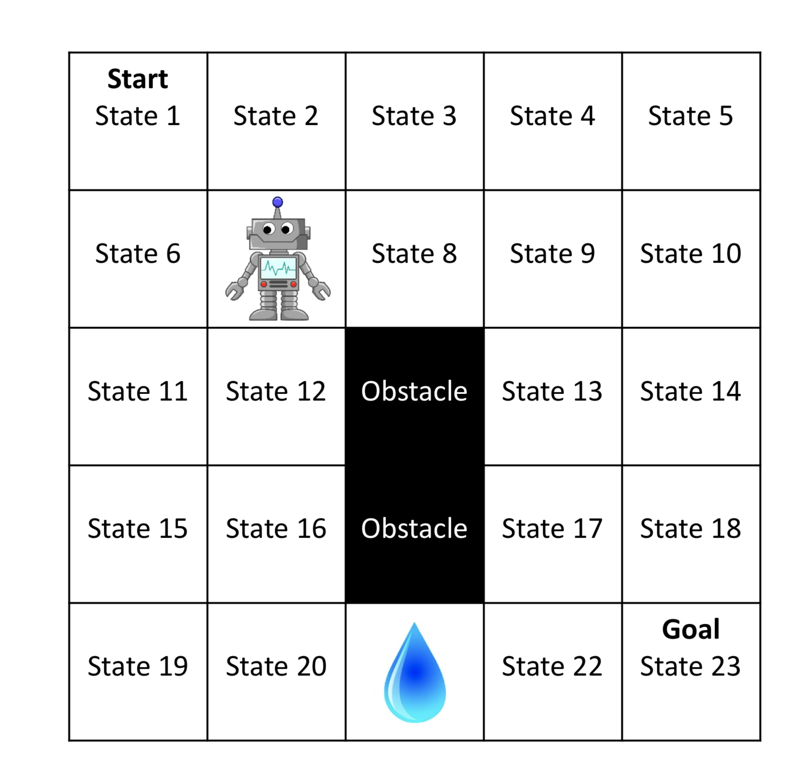

# Reinforcement Learning Algorithm Implementation

## Environment

All the algorithm implementation are based on the two environments, GridWorld and the CartPole environment.

GridWorld Environment look like the image shown below:

CartPole Environment looks like as shown below:

## [FirstChoiceHillClimbing](https://github.com/imraviagrawal/Reinforcement-Learning-Implementation/tree/master/FirstChoiceHillClimbing)
* [First Choice Hill Climbing](https://people.cs.umass.edu/~pthomas/courses/CMPSCI_687_Fall2018/687_F18_main.pdf)  
* [Cross Entropy implementation](https://hal.archives-ouvertes.fr/hal-00738463/document)

## [TD Algorithm](https://github.com/imraviagrawal/Reinforcement-Learning-Implementation/tree/master/TD%20Algorithm)
* [TD Implementation](https://en.wikipedia.org/wiki/Temporal_difference_learning)

